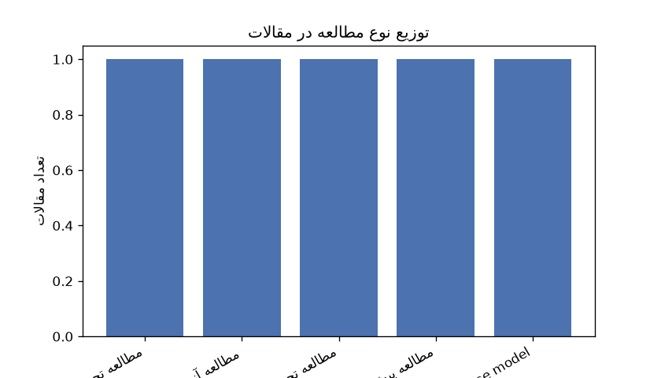
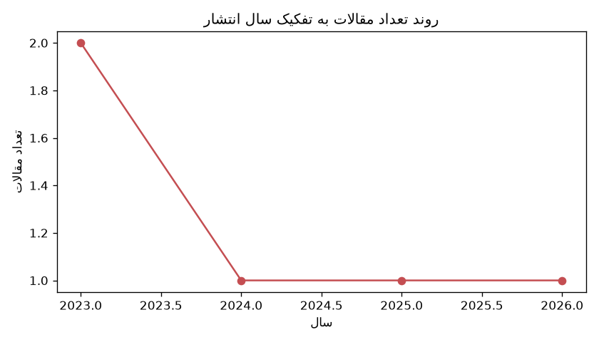

# گزارش تحلیلی مقالات علمی

## خلاصه اجرایی

مرور پنج مطالعه نشان می‌دهد که اگزوزوم‌های مشتق‌شده از سلول‌های بنیادی مزانشیمی (MSCs) به‌عنوان یک راهبرد درمانی فاقد سلول، پتانسیل درمانی قابل‌توجهی در بهبود نارسایی اولیه تخمدان و ترمیم اندومتر دارند. مکانیسم‌های مشترک شامل تنظیم مسیرهای سیگنال‌دهی ایمنی و التهابی (نظیر NF-κB)، تعدیل miRNAهای تنظیمی و مهار آپوپتوز و فروپتوز سلول‌های هدف است. اگرچه پارامترهای عملکردی از جمله تعادل هورمونی و سلامت بافتی در مطالعات همگن هستند، ادبیات پژوهشی هم‌اکنون کاملاً در فاز پیش‌بالینی تثبیت شده و به کارآزمایی‌های بالینی انسانی نرسیده است.

تحلیل داده‌ها سه شکاف پژوهشی کلیدی را آشکار می‌سازد: نخست، فقدان پروتکل‌های استاندارد برای تعیین دوز بهینه، مسیرهای تجویز و ارزیابی پایداری و ایمنی بلندمدت؛ دوم، تمرکز تک‌محوری بر مسیرهای مولکولی مجزا و نیاز به یکپارچه‌سازی شبکه‌های پاتوژنز در مدل‌های بیماری‌زای متنوع؛ و سوم، ناهمگونی روش‌های جداسازی و مشخصه‌یابی، به‌همراه فقدان مقایسه سیستماتیک کارایی اگزوزوم‌های حاصل از منابع مختلف MSC. پر کردن این شکاف‌ها، پیش‌نیاز ضروری برای استانداردسازی، کنترل کیفیت و گذار ایمن از شواهد آزمایشگاهی به کاربرد بالینی است.

## ۱. جدول استخراج اطلاعات کلیدی

| فایل | عنوان (فارسی) | سال | هدف | نوع مطالعه | روش‌شناسی | حجم نمونه | نتایج کلیدی | محدودیت‌ها |
|---|---|---|---|---|---|---|---|---|
| fendo-14-1205901 | بهبود عملکرد و ترمیم تخمدان توسط اگزوزوم‌های مشتق از سلول‌های بنیادی مزانشیمال بند ناف انسان در موش‌های صحرایی مبتلا به نارسایی زودرس تخمدان ناشی از شیمی‌درمانی | 2023 | بررسی اثرات پیوند اگزوزوم‌های مشتق از سلول‌های بنیادی مزانشیمال بند ناف انسان بر عملکرد تخمدان و باروری در موش‌های صحرایی مبتلا به نارسایی زودرس تخمدان ناشی از شیمی‌درمانی از دیدگاه تجلیات بیولوژیکی و | تجربی حیوانی | شناسایی اگزوزوم‌ها با میکروسکوپ الکترونی عبوری (TEM)، تحلیل ردیابی ذرات (NTA) و وسترن بلات برای CD9، CD63 و CD81. ایجاد مدل نارسایی زودرس تخمدان با تزریق داخل صفاقی سیکلوفسفامید (CTX) و بوسولفان (BUS) | 36 | پیوند اگزوزوم‌ها منجر به کاهش سطح FSH و آپوپتوز سلول‌های گرانولوزا، افزایش E2 و AMH، و افزایش تعداد فولیکول‌های تخمدانی و جنین‌های رحمی شد. همچنین، مسیرهای سیگنال‌دهی مرتبط با تنظیم ایمنی، حیات سلولی، | ذکر نشده است |
| s00438-025-02241-x | درمان آسیب اندومتر توسط اکسوزوم‌های مشتق از سلول‌های بنیادی مزانشیمال جفتی در مدل مایه‌ای چسبندگی داخل رحمی | 2025 | بررسی اثرات درمانی اکسوزوم‌های مشتق از سلول‌های بنیادی مزانشیمال جفتی (PMSCs) بر ترمیم اندومتر در مدل مایه‌ای چسبندگی داخل رحمی و روشن‌سازی مکانیسم‌های مولکولی دخیل | مطالعه تجربی/آزمایشگاهی (بررسی در کشت سلولی و مدل مایه‌ای) | جداسازی اکسوزوم‌ها از طریق سانتریفیوژ اولتراسونیک و تأیید با میکروسکوپ الکترونی عبوری، تحلیل ردیابی ذره و وسترن بلات. ایجاد مدل چسبندگی داخل رحمی با کوگولاسیون الکتریکی در موش‌های ماده ۱۰ تا ۱۲ هفته‌ا | ذکر نشده است | اکسوزوم‌های PMSC ضخامت اندومتر را افزایش، تعداد غدد را زیاد و فیبروز را کاهش داد. توالی‌یابی RNA ۳۹۸۰ ژن با بیان افتراقی را شناسایی کرد که عمدتاً در فرآیندهای ایمنی، سیتوتوکسیسیتی میانی‌شده توسط سلول‌ | ذکر نشده است |
| s13287-023-03397-2 | مقایسه اثرات درمانی سلول‌های بنیادی و اگزوزوم‌ها در نارسایی اولیه تخمدان: امیدبخش مانند سلول‌ها اما با ماندگاری و دوز متفاوت | 2023 | بررسی تفاوت‌های اثربخشی، ماندگاری و دوز درمانی میان سلول‌های بنیادی مزانشیمی (MSC) و اگزوزوم‌های مشتق‌شده از آن‌ها در مدل موشی نارسایی اولیه تخمدان (POI) برای ارزیابی قابلیت جایگزینی اگزوزوم‌ها به عنو | مطالعه حیوانی تجربی (مقایسه‌ای) | ایجاد مدل نارسایی اولیه تخمدان در موش‌های C57/BL6 از طریق شیمی‌درمانی، تزریق داخل اوربیتال چهار دوز مختلف MSC یا مقادیر معادل اگزوزوم، تحلیل تغییرات مولکولی در نمونه‌های بافتی و سرمی، و انجام آزمایش‌ه | ذکر نشده است | هر دو گروه تحت درمان با MSC و اگزوزوم، چرخه استروسی و سطح هورمون‌های سرمی را بازیابی کردند. نرخ باروری در گروه MSC پس از درمان ۶۰ تا ۱۰۰ درصد و در گروه اگزوزوم ۳۰ تا ۵۰ درصد بود. در ارزیابی بلندمدت، م | ذکر نشده است |
| s13287-024-04111-6 | اکسوزوم‌های مشتق از سلول‌های بنیادی مزانشیمال هیپوکسیک با تقویت آنژیوژنز عملکرد تخمدان را بازیابی می‌کنند | 2024 | بررسی اینکه آیا پیش‌پردازش هیپوکسیک می‌تواند پتانسیل آنژیوژنیک اکسوزوم‌های مشتق از سلول‌های بنیادی مزانشیمال بند ناف انسان را در مدل آزمایشگاهی نارسایی زودرس تخمدان افزایش دهد یا خیر. | مطالعه پیش‌بالینی آزمایشگاهی (شامل آزمایش‌های در محیط کشت و درون‌تنی) | جداسازی و کشت اولیه سلول‌های بنیادی مزانشیمال بند ناف انسان و اندوتلیال‌های مایکروواسکولار تخمدان موش. استخراج و مشخصه‌یابی اکسوزوم‌ها تحت شرایط نرموکسیک و هیپوکسیک با استفاده از میکروسکوپ الکترونی عب | ذکر نشده است | اکسوزوم‌های مشتق از محیط هیپوکسیک از طریق انتقال miR-205-5p، عملکرد اندوتلیال و آنژیوژنز را به‌طور قابل‌توجهی در محیط کشت و درون‌تنی افزایش دادند. این اکسوزوم‌ها با هدف‌گیری مسیر سیگنالینگ PTEN/PI3K/A | ذکر نشده است |
| s13287-026-04893-x | کاهش نارسایی اولیه تخمدان ناشی از شیمی‌درمانی توسط اگزوزوم‌های مشتق از سلول‌های بنیادی مزانشیمال بند ناف از طریق مهار فروپتوز وابسته به SMURF1 | 2026 | بررسی اینکه آیا اگزوزوم‌های مشتق از سلول‌های بنیادی مزانشیمال بند ناف انسان (HucMSC-Exo) می‌توانند با مهار فروپتوز در سلول‌های گرانولوزای تخمدانی (GCs)، نارسایی اولیه تخمدان (POI) ناشی از شیمی‌درمانی  | مطالعه تجربی پیش‌بالینی (In vivo و In vitro) | تهیه و شناسایی اگزوزوم‌ها با استفاده از سانتریفیوژ فوق‌سنگین، تحلیل ردیابی ذرات نانومتری (NTA)، میکروسکوپ الکترونی عبوری (TEM) و وسترن بلات. ایجاد مدل موشی POI با تزریق داخلی صفاقی سیکلوفسفامید و تجوی | ۴۰ موش ماده ICR (تقسیم به ۵ گروه ۱۰تایی) و سلول‌های گرانولوزای اولیه (تعداد دقیق ذکر نشده است) | تزریق HucMSC-Exo تعادل هورمونی را بازیابی کرد، ذخیره تخمدانی را حفظ نمود و آتروفی فولیکول‌ها و نقص‌های رشدی را در موش‌های POI القا شده با CTX کاهش داد. این اگزوزوم‌ها با تحویل پروتئین یوبیکوئیتین لیگا | ذکر نشده است |

## ۲. تحلیل روندهای پژوهشی

بر اساس داده‌های ارائه‌شده از پنج مقاله، تحلیل زیر به بررسی روندهای مشترک، تفاوت‌های روش‌شناختی و الگوهای کلیدی می‌پردازد. تمام استنادها صرفاً بر اساس اطلاعات ذکرشده در پرسش تنظیم شده‌اند.

### روندهای پژوهشی مشترک
تمامی پژوهش‌های بررسی‌شده بر استفاده از اگزوزوم‌های مشتق‌شده از سلول‌های بنیادی مزانشیمی (MSCs) به‌عنوان عامل درمانی متمرکز هستند. هدف اصلی در چهار مطالعه از پنج مورد، بهبود نارسایی اولیه تخمدان (POI) یا بازگرداندن تعادل تولیدمثلی است، در حالی که مطالعه پنجم بر ترمیم اندومتر و کاهش چسبندگی داخل رحمی تمرکز دارد که هر دو در حیطه میکرومحلی تولیدمثل قرار می‌گیرند. در سطح مکانیسمی، همگرایی قابل‌توجهی در تنظیم مسیرهای سیگنال‌دهی ایمنی و التهابی (مانند NF-κB و مسیرهای مرتبط با حیات سلولی و التهاب)، استفاده از miRNAهای تنظیمی (مانند miR-143، miR-205-5p و سیستم SMURF1/HO-1) و کاهش آسیب‌های سلولی (آپوپتوز و فروپتوز) مشاهده می‌شود. همچنین، گذار پارادایمی به‌سوی رویکردهای «فاقد سلول» (Cell-free) به‌عنوان جایگزینی برای تزریق مستقیم سلول‌های زنده، یک خط مشی مشترک در این ادبیات است.

### تفاوت‌های روش‌شناختی
- **منبع سلولی اگزوزوم‌ها:** در حالی که سه مطالعه از اگزوزوم‌های مشتق از بند ناف انسان استفاده کرده‌اند، یکی اگزوزوم‌های جفتی را برای ترمیم اندومتر به کار برده و یکی به‌طور مستقیم MSCهای کامل را با اگزوزوم‌های مشتق‌شده از آن‌ها مقایسه می‌کند.
- **طراحی مدل‌های آزمایشی:** دو مطالعه به‌طور ترکیبی از محیط‌های کشت (In vitro) و مدل‌های درون‌تنی (In vivo) بهره برده‌اند. یک مطالعه صرفاً بر مدل مایه و کشت سلولی متمرکز است، در حالی که دو مطالعه دیگر تنها به مدل‌های موشی پرداخته‌اند.
- **روش‌های ارزیابی و مداخلات تکمیلی:** تنها یک مطالعه از پیش‌پردازش هیپوکسیک برای تقویت پتانسیل آنژیوژنیک اگزوزوم‌ها استفاده کرده است. در سطح آنالیز، یکی از مطالعات به توالی‌یابی RNA برای شناسایی ۳۹۸۰ ژن با بیان افتراقی پرداخته، یکی بر بررسی سطح انتقال‌یافته پروتئین‌ها (Post-translational) و حذف بیان ژن HO-1 تمرکز دارد، و دیگری به‌طور خاص ماندگاری اثر درمانی را در نسل‌دهی دوم حیوانات آزمایشی ارزیابی می‌کند.
- **پارامترهای خروجی:** متغیرهای اندازه‌گیری‌شده بین مطالعات متفاوت است؛ از پروفایل هورمونی (FSH، E2، AMH) و شمارش فولیکول‌ها گرفته تا ارزیابی باروری نسل‌به‌نسل، ضخامت اندومتر، فیبروز بافتی و شاخص‌های آنژیوژنز و فروپتوز.

### الگوهای قابل‌توجه
- **تطابق منبع با بافت هدف:** به‌نظر می‌رسد اگزوزوم‌های بند ناف برای بافت تخمدان و اگزوزوم‌های جفتی برای بافت اندومتر انتخاب‌شده‌اند که نشان‌دهنده یک الگوی سازگار با فیزیولوژی هدف است.
- **ثبات در نتایج عملکردی:** با وجود تفاوت در مکانیسم‌های مولکولی، همه مطالعات موفق در بازیابی تعادل هورمونی، کاهش آپوپتوز/فروپتوز سلول‌های گرانولوزا و بهبود پارامترهای بافتی (تعداد فولیکول، ضخامت اندومتر، آنژیوژنز) هستند.
- **تمرکز بر دقت مکانیسمی فزاینده:** روند پژوهش‌ها از توصیف اثرات کلی به‌سوی شناسایی دوقطبی‌های دقیق مولکولی (مانند miRNA→MyD88→NF-κB، یا SMURF1→HO-1→فروپتوز) حرکت کرده است.
- **مقایسه عملکردی سلول در برابر ترشح‌ها:** یکی از مقالات به‌صورت مستقیم به این پرسش کلیدی پاسخ داده که آیا اگزوزوم‌ها می‌توانند جایگزین کامل MSCها شوند؟ داده‌ها نشان می‌دهند که اگزوزوم‌ها بازیابی هورمونی مشابهی ایجاد می‌کنند اما ماندگاری اثر و نرخ باروری بلندمدت آن‌ها کمتر از سلول‌های زنده است.

### تفسیر نمودارها
**نمودار ۱ (توزیع نوع مطالعه):** این نمودار نشان می‌دهد که تمامی پنج پژوهش در دسته مطالعات تجربی و پیش‌بالینی قرار دارند که اکثراً شامل مدل‌های حیوانی (موش و مایه) و ترکیبی از آزمایش‌های درون‌تنی و درون‌کشتی هستند. تفسیر این توزیع بیانگر آن است که فاز کنونی این حوزه پژوهشی کاملاً در مرحله شواهد حیوانی و آزمایشگاهی تثبیت شده و هنوز به کارآزمایی‌های بالینی انسانی نرسیده است. همچنین، حضور مطالعات مقایسه‌ای و ترکیبی (In vitro/In vivo) نشان‌دهنده دقت روش‌شناختی محققان در کنترل متغیرها و تفکیک اثرات مستقیم بیولوژیکی از عوامل مزاحم است.

**نمودار ۲ (روند سال انتشار):** این نمودار انتشار مقالات را در بازه زمانی ۲۰۲۳ تا ۲۰۲۶ نشان می‌دهد (دو اثر در ۲۰۲۳، و یک اثر در هر یک از سال‌های ۲۰۲۴، ۲۰۲۵ و ۲۰۲۶). تفسیر این روند صعودی و پیوسته تأیید می‌کند که علاقه پژوهشی به کاربردهای درمانی اگزوزوم‌های سلول‌های بنیادی مزانشیمی در اختلالات تولیدمثلی طی سال‌های اخیر به‌طور مستمر در حال افزایش بوده است. این چارچوب زمانی کوتاه و متراکم، نیاز به به‌روزرسانی مداوای پروتکل‌های استخراج، دوزینگ و مکانیسم‌های دقیق‌تر را در آینده نزدیک برجسته می‌سازد.

### جمع‌بندی
بر اساس داده‌های موجود، ادبیات پژوهشی فعلی به‌طور قاطع به سمت استفاده از اگزوزوم‌های MSC به‌عنوان عامل ترمیمی فاقد سلول در نارسایی تخمدان و آسیب‌های اندومتر حرکت کرده است. در حالی که مکانیسم‌های مشترک شامل تنظیم miRNA، کاهش التهاب/استرس اکسیداتیو و بهبود پارامترهای هورمونی است، تفاوت‌های روش‌شناختی در منبع سلولی، نوع مدل آزمایشی، به‌کارگیری پیش‌پردازش‌های فیزیکی (هیپوکسی)، و تمرکز بر رویدادهای سلولی خاص (مانند فروپتوز یا آنژیوژنز) مشاهده می‌شود. تفسیر نمودار ۱ و نمودار ۲ نیز تأیید می‌کند که این حوزه کاملاً در فاز پیش‌بالینی و تجربی قرار دارد و با توجه به انتشار مداوم مقالات در بازه ۲۰۲۳ تا ۲۰۲۶، شاهد یک روند پژوهشی پویا، فزاینده و متمرکز بر شفاف‌سازی مکانیسم‌های مولکولی هستیم.

**نمودار 1: توزیع نوع مطالعه**

**نمودار 2: روند سال انتشار**

## ۳. شکاف‌های پژوهشی

با بررسی دقیق اهداف، روش‌شناسی و پیام‌های ضمنی پنج پژوهش ارائه‌شده، سه شکاف پژوهشی زیر به‌صورت مستند و غیرحدسی استخراج شده است:

۱. **تعیین پروتکل‌های استاندارد دوز، مسیر تجویز و ارزیابی ایمنی و پایداری بلندمدت درمانی**
   (۱) شواهد مستند: در مطالعه «بررسی تفاوت‌های اثربخشی، ماندگاری و دوز درمانی میان سلول‌های بنیادی مزانشیمی و اگزوزوم‌های مشتق‌شده از آن‌ها در مدل موشی نارسایی اولیه تخمدان»، نویسندگان صراحتاً به پایش بازیابی باروری و اثرات بلندمدت از طریق آزمایش‌های نسل‌دهی موازی اشاره کرده‌اند که نشان‌دهنده فقدان داده‌های پایدار در مطالعات پیشین است. همچنین، ناهمگونی در مسیرهای تجویز مشهود است؛ در حالی که مطالعه «بررسی اثرات پیوند اگزوزوم‌های مشتق از سلول‌های بنیادی مزانشیمال بند ناف انسان بر عملکرد تخمدان...» و مطالعه «بررسی اینکه آیا اگزوزوم‌های مشتق از سلول‌های بنیادی مزانشیمال بند ناف انسان می‌توانند با مهار فروپتوز...» از تزریق وریدی دم استفاده کرده‌اند، مطالعه یادشده از تزریق داخل اوربیتال بهره برده است. هیچ‌یک از مقالات به بررسی سیر تجمعی دارو، پروفایل ایمنی‌زایی، یا پروتکل دوزانینگ واحد برای عبور به مرحله بالینی پرداخته‌اند.
   (۲) اهمیت برای پژوهش‌های آینده: حرکت از درمان‌های مبتنی به سلول زنده به سمت درمان‌های بدون سلول، نیازمند تعیین مسیر بهینه تحویل، دوزهای ایمن و اثربخش، و اثبات ماندگاری و امنیت بلندمدت است. رفع این شکاف پیش‌نیاز ضروری برای طراحی کارآزمایی‌های بالینی، کاهش نوسانات پاسخ درمانی و کسب تأییدیه‌های نظارتی است.

۲. **یکپارچه‌سازی مسیرهای مولکولی چندگانه و اعتبارسنجی متقابل در مدل‌های بیماری‌زایی متفاوت**
   (۱) شواهد مستند: هر پژوهش حاضر تنها بر یک محور یا بارگو (Cargo) مولکولی خاص متمرکز شده است. مطالعه «بررسی اثرات درمانی اکسوزوم‌های مشتق از سلول‌های بنیادی مزانشیمال جفتی بر ترمیم اندومتر...» مسیر تنظیمی miR-143/MyD88 و کانال NF-κB را بررسی کرده است. مطالعه «بررسی اینکه آیا پیش‌پردازش هیپوکسیک می‌تواند پتانسیل آنژیوژنیک اکسوزوم‌های مشتق از سلول‌های بنیادی مزانشیمال بند ناف انسان را افزایش دهد...» بر پتانسیل آنژیوژنیک و شبکه‌های miRNA تأکید دارد. همچنین مطالعه «بررسی اینکه آیا اگزوزوم‌های مشتق از سلول‌های بنیادی مزانشیمال بند ناف انسان می‌توانند با مهار فروپتوز...» مکانیسم HO-1 و آپوپتوز را در سلول‌های گرانولوزا هدف قرار داده است. هیچ‌کدام از این مطالعات هم‌افزایی، رقابت یا توازن این مسیرها را بررسی نکرده‌اند و کلیت یافته‌ها صرفاً در مدل‌های القاشده شیمیایی (سیکلوفسفامید، بوسولفان، سیس‌پلاتین) یا جراحی (کوگولاسیون الکتریکی) ارزیابی شده است.
   (۲) اهمیت برای پژوهش‌های آینده: پاتوفیزیولوژی نارسایی تخمدان و آسیب‌های اندومتر ذاتاً چندوجهی و شبکه‌ای است. درک تعاملات بین‌مسیری و اعتبارسنجی مکانیسم‌ها در سناریوهای آسیب‌زای متفاوت، برای طراحی پروفارم‌های ترکیبی دقیق‌تر، افزایش نرخ پاسخ‌دهی درمانی و جلوگیری از طراحی مداخلات تک‌هدفی ناکارآمد حیاتی است.

۳. **استانداردسازی روش‌های جداسازی، مشخصه‌یابی و مقایسه سیستماتیک کارایی میان منابع مختلف سلول‌های بنیادی مزانشیمی**
   (۱) شواهد مستند: در میان مقالات حاضر، تنوع قابل‌توجهی در منشأ بیولوژیکی و پروتکل‌های جداسازی مشاهده می‌شود. دو پژوهش بر اگزوزوم‌های مشتق از سلول‌های بنیادی مزانشیمال بند ناف انسان تمرکز داشته‌اند، در حالی که مطالعه «بررسی اثرات درمانی اکسوزوم‌های مشتق از سلول‌های بنیادی مزانشیمال جفتی...» از منبع جفتی استفاده کرده است. از نظر روش‌شناسی، اگرچه از میکروسکوپ الکترونی عبوری، تحلیل ردیابی ذرات نانو و وسترن بلات برای نشانگرهای CD9، CD63 و CD81 استفاده شده است، اما تکنیک‌های جداسازی ناهمگون هستند (سانتریفیوژ فوق‌سنگی در یک مقاله و سانتریفیوژ اولتراسونیک در مقاله دیگر) و هیچ داده‌ای درباره خلوص، پروفایل بارگو، یا برتری درمانی نسبی این منابع با یکدیگر ارائه نشده است.
   (۲) اهمیت برای پژوهش‌های آینده: انتخاب منبع بهینه و یکسان‌سازی پروتکل‌های استخراج و مشخصه‌یابی، ضامن تکرارپذیری، کنترل کیفیت (QC) و تولید انبوه (CMC) محصولات اگزوزومی است. مقایسه سیستماتیک این منابع نه‌تنها منجر به انتخاب کارآمدترین کشت سلولی خواهد شد، بلکه موانع صنعتی‌سازی، پایداری ذخیره‌سازی و استانداردهای تنظیمی لازم برای کاربرد بالینی را مرتفع می‌سازد.

## نتیجه‌گیری

**نتیجه‌گیری**

مرور تحلیلی پژوهش‌های حاضر نشان می‌دهد که اگزوزوم‌های مشتق از سلول‌های بنیادی مزانشیمی، به‌عنوان یک راهبرد درمانی فاقد سلول، پتانسیل بالایی در بازسازی بافت‌های تولیدمثلی و بهبود نارسایی عملکردی تخمدان و اندومتر از خود نشان داده‌اند. کارکرد این نانوذرات، عمدتاً از طریق تعدیل پاسخ‌های ایمنی-التهابی، مهار آپوپتوز و فروپتوز، و تحریک آنژیوژنز مبتنی بر تنظیم بیان miRNAها و مسیرهای سیگنال‌دهی کلیدی (مانند NF-κB و محور SMURF1/HO-1) محقق می‌شود. با وجود همگرایی در نتایج عملکردی، ادبیات حاضر کاملاً در گام‌های پیش‌بالینی تثبیت شده و سه شکاف ساختاریِ مستند، گذار این حوزه را به کاربرد بالینی با چالش مواجه می‌سازد. نخست، فقدان دستورالعمل‌های استاندارد برای دوز دقیق، مسیر بهینه‌ی تحویل و پایش طولانی‌مدت پایداری و ایمنی درمانی، مبنای لازم برای طراحی کارآزمایی‌های انسانی را فراهم نکرده است. دوم، تمرکز تک‌بعدی اکثر مطالعات بر یک محور مکانیسمی خاص، با ماهیت شبکه‌ای و چندوجهی پاتوفیزیولوژی اندام‌های تولیدمثلی همخوانی ندارد و نیاز به اعتبارسنجی هم‌افزایی‌های بین‌مسیری در سناریوهای آسیب‌زایی متنوع را پررنگ می‌کند. سوم، ناهمگونی در تکنیک‌های جداسازی، مشخصه‌یابی و فقدان مقایسه‌ی سیستماتیک میان منابع مختلف سلولی، تکرارپذیری، کنترل کیفیت و مقایسه‌ی کارایی نسبی را با مانع جدی مواجه ساخته است. در نتیجه، حرکت به سوی شفافیت مکانیسمی، یکسان‌سازی معیارهای استخراج و بارگیری، و طراحی مطالعات مقایسه‌ای بلندمدت، پیش‌نیازهای ضروری برای عبور از فاز آزمایشگاهی، غلبه بر موانع صنعتی‌سازی و تأمین امنیت و کارایی لازم برای ورود به گام‌های بالینی محسوب می‌شوند.

## منابع / مستندات پایه

- fendo-14-1205901 — بهبود عملکرد و ترمیم تخمدان توسط اگزوزوم‌های مشتق از سلول‌های بنیادی مزانشیمال بند ناف انسان در موش‌های صحرایی مبتلا به نارسایی زودرس تخمدان ناشی از شیمی‌درمانی
- s00438-025-02241-x — درمان آسیب اندومتر توسط اکسوزوم‌های مشتق از سلول‌های بنیادی مزانشیمال جفتی در مدل مایه‌ای چسبندگی داخل رحمی
- s13287-023-03397-2 — مقایسه اثرات درمانی سلول‌های بنیادی و اگزوزوم‌ها در نارسایی اولیه تخمدان: امیدبخش مانند سلول‌ها اما با ماندگاری و دوز متفاوت
- s13287-024-04111-6 — اکسوزوم‌های مشتق از سلول‌های بنیادی مزانشیمال هیپوکسیک با تقویت آنژیوژنز عملکرد تخمدان را بازیابی می‌کنند
- s13287-026-04893-x — کاهش نارسایی اولیه تخمدان ناشی از شیمی‌درمانی توسط اگزوزوم‌های مشتق از سلول‌های بنیادی مزانشیمال بند ناف از طریق مهار فروپتوز وابسته به SMURF1
